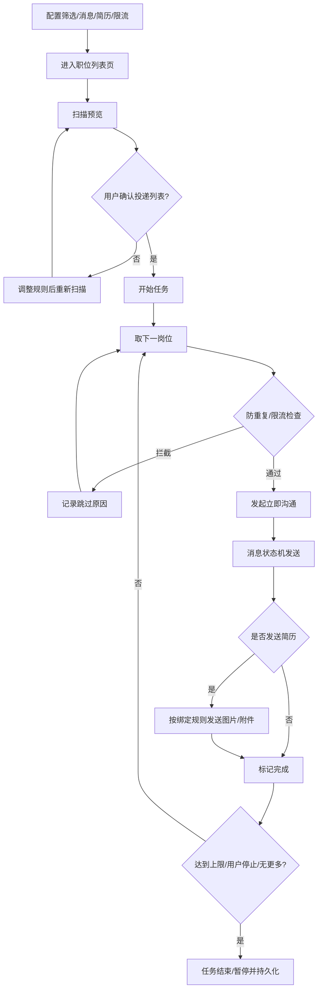

# 产品需求文档（PRD）

| 字段 | 内容 |
|------|------|
| 产品名称 | Boss 海投助手 |
| 文档版本 | v1.0 |
| 日期 | 2026-07-29 |
| 状态 | Draft |
| 适用版本 | V1（P0）/ V2（P1） |
| 关联 ADR | ADR-0002 ~ ADR-0010 |

---

## 1. 背景与问题

求职者在 BOSS 直聘上批量沟通岗位时，存在以下痛点：

1. **重复劳动高**：滚动、筛选、点击沟通、发送介绍、发送简历高度重复。
2. **误投成本高**：筛选规则一处配置错误，会在短时间内造成大量不相关沟通。
3. **消息重复**：BOSS 原生打招呼语与插件自定义消息容易叠加，形成重复自我介绍。
4. **简历发错**：多岗位方向、多简历版本并存时，容易发错图片页序或旧版附件。
5. **任务不可控**：中断、刷新、异常后难以恢复；跳过原因不透明。

公开同类插件普遍已具备自动批量沟通、关键词/地区/薪资/HR 活跃筛选、本地防重复、任务面板、日志与 AI 回复等能力。仅实现“多段自我介绍 + 图片简历”不足以形成差异。

**产品差异化主张：**

> 投递前可预览、筛选原因可解释、消息不会重复、简历不会发错、任务随时可控。

不要把“投得更多 / 绕过平台风控”作为卖点。

---

## 2. 目标与非目标

### 2.1 产品目标

| 编号 | 目标 | 衡量方式 |
|------|------|----------|
| G1 | 降低批量沟通的重复操作时间 | 同等投递量下人工点击步骤显著减少 |
| G2 | 降低误投与重复沟通 | 预览后确认率、跳过原因可解释率、重复投递率 |
| G3 | 提高消息与简历发送准确性 | 重复消息率、错误简历发送率接近 0 |
| G4 | 保证任务可控与可恢复 | 暂停/继续/停止可用；刷新后可恢复进行中任务 |
| G5 | 默认保护隐私与账号安全 | 简历与配置默认本地；可见的频率与数量限制 |

### 2.2 非目标（V1 明确不做）

1. 不承诺绕过平台限制、验证码、风控或消息上限。
2. 不做全自动无确认 AI 回复（薪资/到岗/经历等敏感信息风险过高）。
3. 不做跨平台统一投递中台（V1 仅聚焦 BOSS 直聘 Web）。
4. 不默认将简历、聊天内容上传自有服务器。
5. 不以“速度极限自动点击”作为核心指标。

---

## 3. 用户与场景

### 3.1 目标用户

| 角色 | 描述 | 核心诉求 |
|------|------|----------|
| 应届生 / 实习求职者 | 投递量大、岗位方向相对集中 | 快、稳、少误投 |
| 社招跳槽用户 | 多城市/多方向并行 | 多简历策略、防重复 |
| 精细求职用户 | 关注匹配质量与转化 | 预览、解释、漏斗统计（V2） |

### 3.2 核心使用场景

1. **批量沟通前先预览**：用户配置筛选与消息模板后，先扫描当前列表，查看“将投 / 将跳过及原因”，确认后再开始。
2. **多段自我介绍不重复**：点击立即沟通后，自动处理 BOSS 原生打招呼与插件消息去重，按顺序发送补充段落。
3. **按岗位发送对应简历**：命中“算法/LLM”规则时发送 AI 简历；命中“Java/Spring”时发送后端简历。
4. **中途暂停与恢复**：用户临时处理消息或页面刷新后，可从断点继续，不重复已发送段落/简历。
5. **排查为何跳过**：日志明确写出“命中排除词外包 / 地点不匹配 / 7 天内已沟通”等原因。

---

## 4. 产品范围与优先级

### 4.1 V1（P0）必须交付

| 模块 | 能力摘要 | 关联需求 |
|------|----------|----------|
| 筛选引擎 | 职位/公司/JD/地点分字段 AND·OR·NOT；薪资、经验、学历、活跃等 | FR-01 |
| 投递前预览 | 扫描统计 + 结果列表 + 原因；用户确认后才发送 | FR-02 |
| 多段消息 | 三种发送模式；文本标准化相似度去重；模板变量；顺序发送 | FR-03 |
| 简历发送 | 图片简历与附件简历独立开关；顺序、校验、防重复 | FR-04 |
| 多简历绑定 | 多档案 + 岗位关键词规则绑定 | FR-05 |
| 防重复 | 职位 / HR / 公司三级；幂等键；历史任务去重 | FR-06 |
| 任务控制 | 开始/暂停/继续/停止/跳过；异常恢复；当前步骤展示 | FR-07 |
| 限流安全 | 本次/每日上限、公司上限、间隔、连续失败暂停 | FR-08 |
| 日志可解释 | 实时进度、成功/跳过/失败及原因 | FR-09 |
| 本地配置 | 规则、模板、黑名单、简历元数据、记录导入导出 | FR-10 |

### 4.2 V2（P1）建议交付

| 模块 | 能力摘要 |
|------|----------|
| 多求职方案 | 一键切换城市/方向的完整配置集 |
| 漏斗统计 | 扫描→匹配→沟通→已读→回复→简历请求→面试 |
| 规则解释增强 | 匹配分、通过原因、风险项可视化 |
| 语义匹配 | 关键词召回 + 简历/JD 二次排序（可选模型） |
| AI 回复建议 | 生成候选 → 用户确认 → 发送（默认非全自动） |
| 跟进提醒 | 已读未回、待发简历、面试未确认等提醒与一键操作 |

---

## 5. 功能概述

### 5.1 多段发送信息

提供三种模式（默认 **模式 C 自动识别**）：

| 模式 | 行为 |
|------|------|
| A 使用原生打招呼 | 插件不发第一段，只发补充内容 |
| B 完全由插件发送 | 用户关闭原生打招呼，全部由插件发送 |
| C 自动识别（默认） | 读取会话最近本人消息，与插件第一段做相似度判断，重复则跳过 |

补充要求：

- 文本标准化后再比相似度（空白、标点、表情、你好类前缀）。
- 建立发送状态机与幂等键，刷新/重试不重复发送已完成段落。
- 支持段落启停、拖拽排序、间隔、最大段数、发送前预览、字数提示、模板变量。
- 模板变量解析失败时禁止发出原始占位符。

### 5.2 自动发送图片简历

- 图片简历使用独立开关。
- 默认时机建议：文本发送完成后；“首次沟通后立即发送”为用户显式选择。
- 图片：多页顺序串行发送，格式/大小校验，失败可重试，防重复。
- 简历默认仅本地保存（扩展存储 / IndexedDB），首次需用户主动选择文件。
- BOSS 自带“发简历”按钮要求招聘者先回复，不参与自动投递。

### 5.3 职位与地点筛选

不要只做一个“包含关键词”输入框，应支持：

```text
职位包含任意（OR）
职位必须同时包含（AND）
职位排除任意（NOT）
公司 / JD / 地点 同样分字段配置
地点精确匹配 / 包含匹配
```

逻辑示例：

```text
(Java OR Go OR 后端)
AND Agent
AND 大模型
AND NOT (外包 OR 驻场 OR 销售 OR 培训)
```

### 5.4 防重复、任务、限流、日志

详见 FRS 对应章节与 ADR-0005/0006/0008/0010。

---

## 6. 用户流程（V1 主路径）



---

## 7. 成功指标（建议）

| 指标 | V1 目标 |
|------|---------|
| 预览后误投率 | 相对无预览显著下降（以用户抽检为准） |
| 重复消息发送率 | < 1%（同 jobId + segment） |
| 错误简历发送率 | < 1% |
| 任务可恢复率 | 刷新后进行中任务可恢复 ≥ 95% |
| 跳过原因可解释率 | 100% 系统跳过均有原因码与文案 |
| 配置可导出 | 支持 JSON 导入导出 |

---

## 8. 约束与合规

1. 产品定位为**用户辅助工具**，操作应可被用户理解、暂停和终止。
2. 遵守 BOSS 直聘用户协议精神：不宣传干扰平台服务、不鼓励绕过限制。
3. 敏感数据（简历、手机号、邮箱等）默认本地存储，不上传自有后端。
4. 频率与数量限制对用户可见、可配置，且提供安全默认值。

---

## 9. 里程碑建议

| 阶段 | 交付 |
|------|------|
| M1 | 筛选引擎 + 预览扫描 + 日志原因 |
| M2 | 多段消息状态机 + 原生打招呼去重 |
| M3 | 图片简历 + 多简历绑定 |
| M4 | 三级防重复 + 限流 + 任务恢复 |
| M5 | 配置导入导出 + 稳定性打磨 + V1 验收 |
| M6+ | V2：方案/漏斗/解释增强/AI 建议/跟进 |

---

## 10. 风险

| 风险 | 影响 | 缓解 |
|------|------|------|
| 页面 DOM/流程变更 | 自动化失效 | 选择器抽象、步骤可观测、失败自动暂停 |
| 平台消息/沟通限制 | 任务中断 | 可见限流、连续失败暂停、友好提示 |
| 规则配置错误 | 大量误投 | 强制预览确认、原因解释、上限保护 |
| 简历隐私泄露 | 信任崩塌 | 本地优先、无默认上传、最小权限 |
| 与同类功能同质化 | 增长乏力 | 强化预览/解释/幂等/可控差异点 |

---

## 11. 开放问题

1. V1 是否需要“人工逐条确认后再沟通”模式作为额外安全档。
2. 图片简历存储上限与压缩策略默认参数。
3. 相似度去重阈值默认值（建议 0.85，可配置）。
4. “同一公司每天最多 N 个岗位”的默认 N（建议 3）。
5. V2 AI 能力是否仅本地/用户自备 Key，还是可选云端。

---

## 12. 文档关联

- 功能细节：[FRS.md](./FRS.md)
- 非功能：[NFR.md](./NFR.md)
- 决策记录：[../adr/README.md](../adr/README.md)
